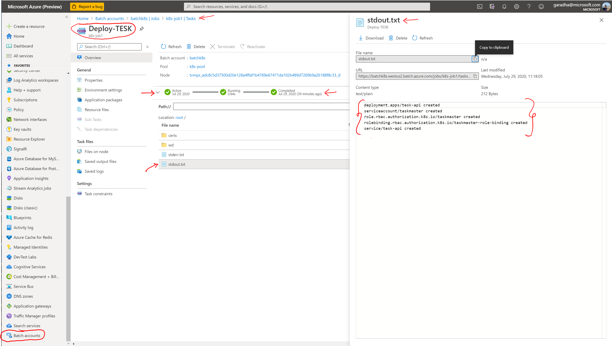

# An application framework for running HPC workloads on Kubernetes on Azure Batch Service

More and more customers are now turning to **Kubernetes** container platform as it provides a flexible, reliable, highly available and scalable platform for running HPC workloads.

To efficiently run HPC workloads on public clouds, there is a need to automate the steps for 
- Provisioning/Decommissioning IaaS VMs of varying compute capacities
- Deploying stand-alone Kubernetes cluster on high capacity compute/VMs &
- Deploying HPC workloads such as [GA4GH](https://www.ga4gh.org/) compliant TES engines on Kubernetes cluster

This GitHub project 
- Details the steps for provisioning a standalone Kubernetes cluster on Azure Batch Service (a.k.a **Engine**). Azure Batch is a job scheduling and compute management platform that enables running large scale parallel and HPC applications efficiently in the cloud.
- Provides a simple application framework for deploying HPC workloads such as GA4GH TES servers on the *Engine*.  The framework provides an API layer which customers can easily extend and build upon to meet their unique needs and requirements. 

## Prerequisites

- Azure CLI (2.7+) installed on your workstation/VM
- Azure Container Registry (ACR) or access to Docker Hub
- Visual Studio 2019, or [.NET Core 3.1](https://dotnet.microsoft.com/download/dotnet-core/3.1) for Linux, macOS, or Windows installed on your workstation/VM

## Functional Architecture


## Resources

- [Docker documentation](https://docs.docker.com/)
- [Kubernetes documentation](https://kubernetes.io/docs/home/)
- [Azure Linux VM documentation](https://docs.microsoft.com/en-us/azure/virtual-machines/linux/)
- [Azure Batch Service documentation](https://docs.microsoft.com/en-us/azure/batch/)
- [Azure Batch Service .NET Core SDK](https://docs.microsoft.com/en-us/dotnet/api/overview/azure/batch/client?view=azure-dotnet)
- [Azure Storage documentation](https://docs.microsoft.com/en-us/azure/storage/)
- [Azure Storage .NET Core SDK v12](https://docs.microsoft.com/en-us/dotnet/api/overview/azure/storage.blobs-readme?view=azure-dotnet)
- [TESK](https://github.com/EMBL-EBI-TSI/TESK)

**Important Notes:**
- An **Engine** in the context of this project refers to an instance of *Kubernetes running on Azure Batch*
- Within all command snippets, a command preceded by a hash ('#') symbol denotes a comment.
- For Azure CLI commands, provide values for all command parameters enclosed within angle brackets ('<'...'>').

## A. Create and store a custom Linux VM image in an Azure Shared Image Gallery

Follow the steps below.

1. Provision a Linux VM on Azure

   Use one of the Azure marketplace Linux images and provision a VM. Refer to the docs [here](https://docs.microsoft.com/en-us/azure/virtual-machines/linux/cli-ps-findimage) to view the available Linux images.  Then follow the steps [here](https://docs.microsoft.com/en-us/azure/virtual-machines/linux/tutorial-manage-vm) to provision a VM on Azure.

   >**NOTE:** The scripts included in this project have been tested to work with Ubuntu/Debian Linux.  You may need to tweak the shell scripts / commands if you decide to use a different Linux flavor.

2. Install Docker container engine on the Linux VM

   Login to the Linux VM via SSH.  Follow the instructions [here](https://docs.docker.com/engine/install/ubuntu/) to install **docker-ce** container engine on the VM.  Then configure [docker to start on boot](https://docs.docker.com/engine/install/linux-postinstall/#configure-docker-to-start-on-boot).

3. Deprovision, deallocate and generalize the Linux VM

   Refer to the command snippet below to **deprovision** the VM.
   ```
   # Deprovision the VM.
   $ sudo waagent -deprovision+user
   #
   ```
   Log out of the VM.

   Refer to the command snippet below to **deallocate** and **generalize** the VM.
   ```
   # Remember to substitute appropriate values for Azure Resource Group and VM Name.
   #
   # Deallocate the VM.  This command deallocates and shuts the VM down.
   $ az vm deallocate -g <resource-group-name> -n <linux-vm-name>
   #
   # Generalize the VM.  VM cannot be started after running this command.
   $ az vm generalize -g <resource-group-name> -n <linux-vm-name>
   #
   ```

4. Create a shared image gallery, image definition and image version

   >**NOTE:** The Azure resources created in this step can also be provisioned via the Azure Portal.

   Refer to the command snippet below.
   ```
   # Remember to substitute appropriate values for 
   # - Azure Resource Group
   # - Image publisher name
   # - Target regions for image version
   # - Replica counts for image version
   #
   # Create a shared image gallery.
   $ az sig create -g <resource-group-name> --gallery-name k8sGallery
   #
   # Create a shared image definition.
   $ az sig image-definition create \
       --resource-group <resource-group-name> \
       --gallery-name k8sGallery \
       --gallery-image-definition k8sMasterImage \
       --publisher <publisher-name> \
       --offer k8sBatch \
       --sku 1.0 \
       --os-type Linux \
       --os-state generalized
   #
   # Save the image ID in an env variable
   $ ImageID=$(az image list --query "[].[id]" -o tsv)
   #
   # Create the image version
   $ az sig image-version create \
       --resource-group <resource-group-name> \
       --gallery-name k8sGallery \
       --gallery-image-definition k8sMasterImage \
       --gallery-image-version 2020.10.1 \
       --target-regions "westus2=1" \
       --replica-count 1 \
       --managed-image $ImageID
   #
   ```

## B. Create Azure Batch Account and Service Principal

1. Create an Azure Batch Account

   Refer to the [samples](https://docs.microsoft.com/en-us/azure/batch/cli-samples) or Quickstarts in the Azure Batch documentation to create an Azure Batch account.  You only need to create a Batch **account** at this point.  There is no need to create a batch pool.

2. Create an Azure AD Service Principal

   The service principal will be used by the framework to create a batch pool, jobs, tasks etc.

   Refer to this documentation [resource](https://docs.microsoft.com/en-us/azure/active-directory/develop/howto-create-service-principal-portal#register-an-application-with-azure-ad-and-create-a-service-principal) to register an application with Azure AD and create a service principal.

3. Assign permissions to the Azure AD Service Principal

   After creating the Azure Service Principal, it has to be assigned 'Contributor' permissions for 
   - Azure Batch Account and 
   - Shared Image Gallery image version

   Refer to the documentation link in previous step to assign permissions to the service principal. 

## C. Create Azure Storage Account and Blob containers

The Azure Storage Account is used to store applications, Kubernetes resources and TESK applications/tasks.  These artifacts are stored in individual blobs in respective storage containers.

1. Create an Azure Storage Account

   Refer to Azure Storage [Documentation](https://docs.microsoft.com/en-us/azure/storage/common/storage-account-create?toc=%2Fazure%2Fstorage%2Fblobs%2Ftoc.json&tabs=azure-portal) to create an general purpose v2 storage account.

2. Create Storage Blob Containers

   Refer to this Azure Storage [Quickstart](https://docs.microsoft.com/en-us/azure/storage/blobs/storage-quickstart-blobs-portal) and create the following Blob containers.  Refer to the table below.

   Name | Description
   ---- | -----------
   apps | Stores applications which need to be deployed on Azure Batch Pool VM's.
   k8sresources | Stores Kubernetes application deployment manifests
   tesk-tasks | Stores TESK applications (eg., Genomics tasks) to be run on Kubernetes

3. Upload project artifacts to Blob Containers

   Use [Azure Portal](https://portal.azure.com) to upload the project files to respective storage containers as listed in the table below.

   Storage Container | Directory | Description
   ----------------- | ----- | -----------
   apps | `./task-scripts/apps` | Copy all files in the folder/directory to the storage container.
   k8sresources | `./k8sresources/tesk` | Copy all files in the folder/directory to the storage container.
   tesk-tasks | `./tesk-tasks` | Copy all files within sub-folders to the storage container.  Create sub-folders (virtual directories) within the storage container as necessary.

## D. Run and test the sample HPC application

In this final step, we will run the provided sample application (`Program.cs`) a.k.a *Client Driver*.  This application will use the application framework (API) to provision
 - Azure Batch Pool VM
 - A single node Kubernetes cluster on the pool VM
 - TESK runtime (API Server) on Kubernetes
 - Run a simple 'Hello World' task on TESK

Follow the steps below to deploy the engine and run a sample application.
   
1. Set environment variables 

   Before running the sample application, set environment variables listed in the table below to appropriate values.  You can use the shell script `./set-env.test.sh` to configure the env variables for the current shell session.

   Environment Variable Name | Value | Description
   ------------------------- | ----- | -----------
   AZURE_AD_TENANT_ID | Required | Azure AD Tenant ID.  Use Azure Portal or CLI to determine this value.
   AZURE_AD_SP_CLIENT_ID | Required | An Azure Service Principal ID with appropriate permissions to access the Azure Batch and Shared Image Gallery image resources.  Refer to [Azure AD documentation](https://docs.microsoft.com/en-us/azure/active-directory/develop/howto-create-service-principal-portal) to create a Service Principal and assign it relevant permissions. 
   AZURE_AD_SP_CLIENT_SECRET | Required | Secret for the Azure AD Service Principal.
   AZURE_BATCH_ACCOUNT_NAME | Required | Name of the Azure Batch account.
   AZURE_BATCH_ACCOUNT_URL | Required | Batch account URL in the form - https://[AZURE_BATCH_ACCOUNT_NAME].[AZURE_REGION].batch.azure.com
   AZURE_BATCH_VM_IMAGE_ID | Required | Resource ID of the shared image gallery image.
   AZURE_BATCH_VM_SIZE | Required | Azure VM SKU.  Default: STANDARD_D2_V3.
   AZURE_BATCH_VM_NODE_COUNT | Required | Default: 1.  Leave this value as-is.
   AZURE_ACR_NAME | Optional | Name of Azure Container Registry (ACR).
   AZURE_ACR_USER | Optional | Login name for ACR.
   AZURE_ACR_USER_PWD | Optional | Login name password for ACR.
   AZURE_STORAGE_ACCOUNT_NAME | Required | Name of the Azure Storage account.
   AZURE_STORAGE_ACCOUNT_KEY | Required | Key for the Azure Storage account.
   AZURE_STORAGE_APP_DIRECTORY | Required | Azure storage container (name) where VM applications are stored.
   AZURE_STORAGE_K8S_DIRECTORY | Required | Azure storage container (name) where Kubernetes application manifests are stored.

2. Run the sample application on the engine

   Refer to the command snippet below to build and run the sample application.
   ```
   # Switch to the project root directory 'azure-batch-k8s-jobs'
   #
   # Build the sample application. You should have VS Studio Code or .NET Core 3.1 SDK installed on your
   # machine.  When the build finishes, make sure there are no compilation errors or warnings before 
   # proceeding.
   #
   $ dotnet build
   #
   # Run the sample application.  The application will print log messages and wait for the tasks to complete.
   # The application will take approx. 10 mins to finish when it's run for the first time. Both the batch 
   # pool VM and Kubernetes cluster will be provisioned.  Subsequent tasks runs should finish fast.
   #
   $ dotnet run
   #
   ```

3. View and verify task execution results

   Login to [Azure Portal](https://portal.azure.com) to view the task execution results.

   Verify Kubernetes cluster was deployed on Azure Batch. Navigate from the **Pools** blade to the **startup** folder on the batch pool VM (Node). See screenshot below.

   

   View the output of Kubernetes deployment tasks.  Navigate from the **Jobs** blade to view the status of all tasks.  You can also drill down into specific **Tasks** to view the output of each task.  See screenshots below.

   

   

## Project code of conduct

This project has adopted the [Microsoft Open Source Code of Conduct](https://opensource.microsoft.com/codeofconduct/). For more information see the [Code of Conduct FAQ](https://opensource.microsoft.com/codeofconduct/faq/) or contact [opencode@microsoft.com](mailto:opencode@microsoft.com) with any additional questions or comments.
